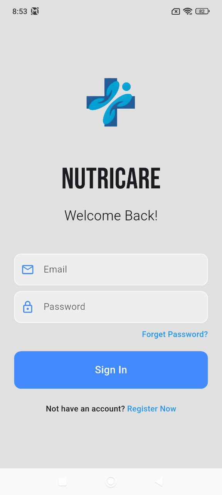
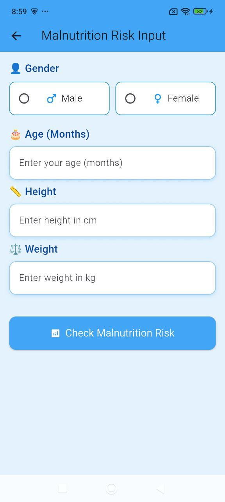
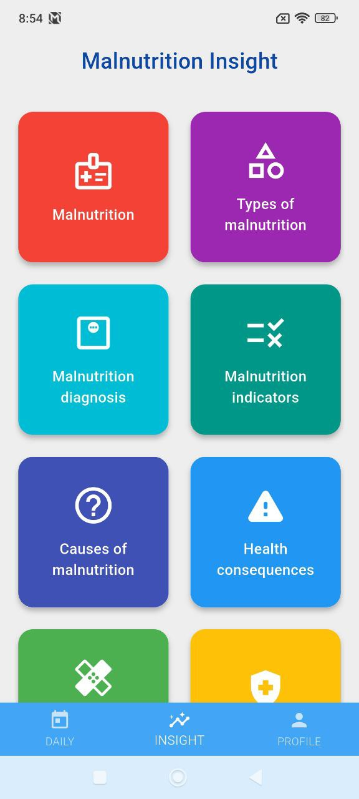
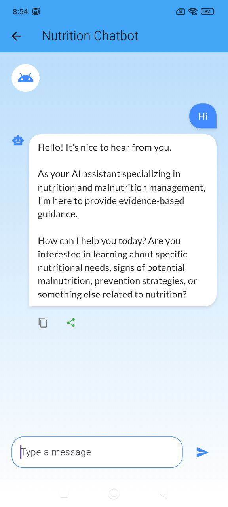
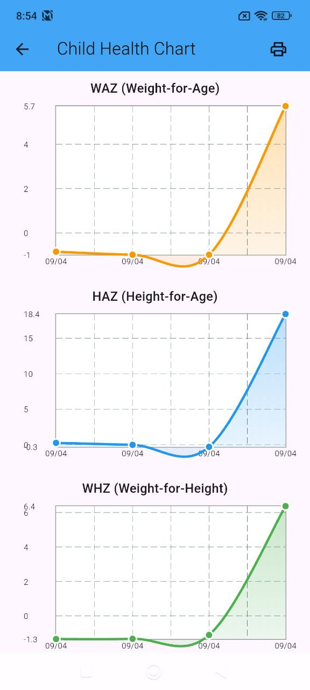
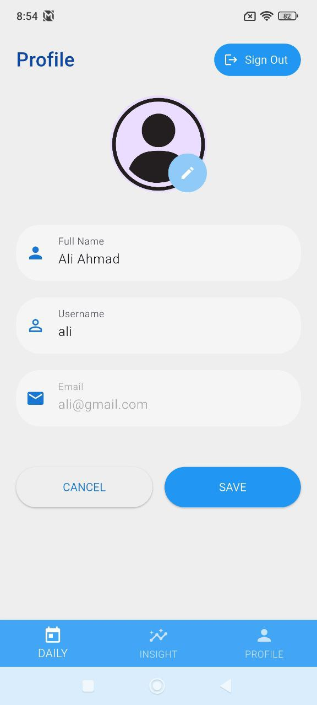

# 🌱 NutriCare — Smart Malnutrition Detection & Growth Monitoring App

**NutriCare** is a mobile health (mHealth) application designed to assist parents and caregivers in the early detection and prevention of childhood malnutrition. Powered by Flutter and Firebase, NutriCare combines intuitive design, real-time monitoring, educational content, and AI-assisted tools — including a smart chatbot — to improve child nutrition and growth tracking, especially in underserved communities.

---

## 🚀 Application Overview

NutriCare addresses key issues around childhood malnutrition by offering a user-friendly, AI-driven platform to:
- Detect malnutrition at early stages.
- Track and visualize children’s growth patterns.
- Provide expert nutrition guidance through a built-in chatbot.
- Educate caregivers on healthy eating and monitoring practices.

Whether you're a parent, caregiver, or healthcare worker, NutriCare empowers you with the tools to improve a child's nutritional well-being.

---

## 🎯 Key Features

### ✅ Children Malnutrition Detection
- Uses **WHO child growth standards** to assess risk.
- Flags undernutrition indicators like **Underweight**, **Stunted Growth**, and **Wasting**.

### 📈 Interactive Growth Graphs
- **Weight-for-Age**
- **Height-for-Age**
- **Weight-for-Height**
- Intuitive visualizations help you understand trends over time.

### 💬 Smart Nutrition Chatbot
- Ask questions about child health and nutrition 24/7.
- Get guidance on meal planning, symptom checking, and balanced diets.
- Available in conversational format for better accessibility using Gemini.

### 👶 Multi-Child Profile Management
- Add and manage multiple children's data.
- Personalized insights based on age, gender, and growth stats.

### 📚 Educational Content Hub
- Tips on balanced meals, nutrition facts, and portion control.
- Curated content to raise awareness among parents and guardians.

### 🔒 Secure Login & Cloud-Based Sync
- Firebase Authentication ensures secure sign-in/sign-up.
- Firestore enables real-time syncing of data across devices.

---

## 🌍 SDG Alignment

NutriCare contributes to the following **UN Sustainable Development Goals (SDGs)**:

- **SDG 3: Good Health and Well-being** – By promoting better child health outcomes via monitoring and education.
- **SDG 9: Industry, Innovation and Infrastructure** – By leveraging innovative mobile health technology to address malnutrition and improve healthcare accessibility.

---

## 🛠️ Tech Stack

- **Frontend:** Flutter (Dart)
- **Backend:** Firebase (Auth + Firestore)
- **AI Chatbot:** Dialogflow / Custom NLP integration
- **Charts & Graphs:** Custom Flutter chart packages
- **Platform:** Cross-platform (Android & iOS)

---

## 📷 Screenshots

 <!-- Row 1 (4 images side-by-side) -->    

  
<!-- Row 2 (3 images side-by-side) -->    

